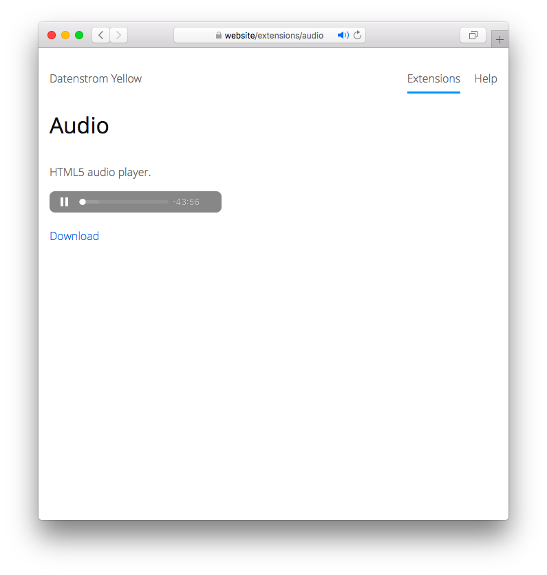

<a href="README-de.md">Deutsch</a> &nbsp; <a href="README.md">English</a>

# Audio 0.9.1

HTML5-Audio-Player.

## Wie man eine Erweiterung installiert

[ZIP-Datei herunterladen](https://github.com/schulle4u/yellow-audio/archive/refs/heads/main.zip) und in dein `system/extensions`-Verzeichnis kopieren. [Weitere Informationen zu Erweiterungen](https://github.com/annaesvensson/yellow-update/tree/main/README-de.md).

## Wie man den Player verwendet

Erstelle eine `[audio]`-Abkürzung.
 
Die folgenden Argumente sind verfügbar, mit Ausnahme des ersten Arguments sind alle Angaben optional:

`Url` = URL zur Audiodatei, z. B. OGG oder MP3  
`Download` = Zeige einen Download-Link für die Audiodatei, 1 oder 0  
`Style` = CSS-Klasse für den Player 

## Wie man Audiolinks verwendet

Erstelle einen Notizblock mit der ID `audiolist`. Jeder Link darin wird als Audiolink behandelt. Um die Player-Steuerelemente einzublenden, erstelle eine `[audiocontrols]`-Abkürzung auf deiner Seite. 

## Beispiele

Eine einzelne Audiodatei einbetten:

    [audio /media/downloads/demo.mp3]

Eine einzelne Audiodatei einbetten, Stil anpassen:

    [audio /media/downloads/episode-47.mp3 - right]

Audiodatei von einer externen URL abrufen und Downloads erlauben: 

    [audio http://wolke.robbenradio.de/podcasts/rt033_yellow.mp3 1]

Inhaltsdatei mit einer Liste abspielbarer Dateien:

~~~
---
Title: Audioseite
---
Hier ist eine Liste von Audiodateien. Klicke einfach auf einen der Links um sie abzuspielen. Zum Speichern einer Datei verwende einen Rechtsklick und wähle "Speichern unter". 

! {#audiolist}
! * [Datei 1](/media/downloads/datei1.mp3)
! * [Datei 2](/media/downloads/datei2.mp3)
! * [Externe Datei](http://wolke.robbenradio.de/podcasts/rt033_yellow.mp3)
! * [Radio-Stream](https://stream.powerradio4u.de:8000/p4u.mp3)

[audiocontrols]
~~~

## Einstellungen

Die folgenden Einstellungen können in der Datei `system/extensions/yellow-system.ini` vorgenommen werden:

`AudioDownload` = Zeige einen Download-Link für Audiodateien, 1 oder 0  
`AudioUrlPrefix` = URL-Präfix für Audiodateien auf einem CDN  
`AudioStyle` = CSS-Klasse für den Player  

## Danksagung

Vielen Dank an die Datenstrom-Yellow-Gemeinschaft für Hilfe und Feedback!

## Entwickler

Steffen Schultz. [Hilfe finden](https://datenstrom.se/de/yellow/help/).
